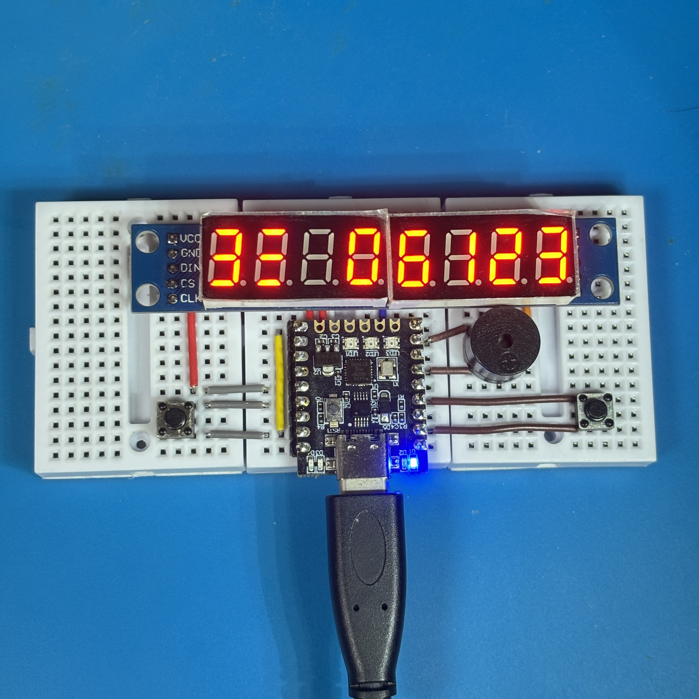
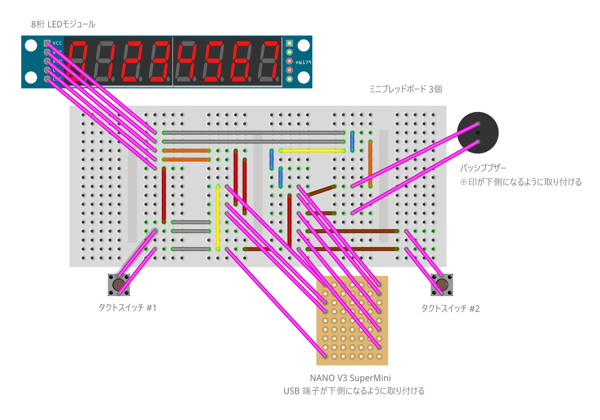

# Arduino: Nano-NumberAttack8

迫りくる数字インベーダーに照準の数字を合わせて撃ち落とすゲームです。

## 部材

| 名称 | 型番等 | 数量 |
| :-- | :-- | :-- |
| ミニブレッドボード | 170H | 3個 |
| ジャンパーワイヤ | - | 適量 |
| タクトスイッチ | 2P 6x6mm | 2個 |
| 8桁 LED モジュール | 0.56" 赤 MAX7219 | 1個 |
| パッシブブザー | 12085 | 1個 |
| マイコン | NANO V3 SuperMini | 1個 |

## 配線図

| 接続先 | ピン |
| :-- | :-- |
| 照準ボタン | A3 |
| 発射ボタン | D6 |
| ブザー | D8 |
| MAX7219 DIN | A0 |
| MAX7219 CS | A1 |
| MAX7219 CLK | A2 |

## プログラム開発環境

### 統合開発環境

Arduino 公式サイト [https://www.arduino.cc/en/software/#ide](https://www.arduino.cc/en/software/#ide) からダウンロード、インストールしてください。

### ボードマネージャー

Arduino IDE に標準で含まれている「Arduino AVR Boards」を使用します。

### 依存ライブラリ

Arduino IDE のライブラリマネージャーで、以下のライブラリをインストールしてください。

| 名称 | 説明 |
| :-- | :-- |
| DigitalButton | タクトスイッチ制御 |

## ビルド・書き込み手順

1. Arduino IDE で `Nano-NumberAttack8.ino` を開く
2. 「ツール」→「ボード」→「Arduino AVR Boards」→「Arduino Nano」を選択
3. USB ケーブルで Arduino Nano を接続
4. 画面上部の右向き矢印ボタン（アップロード）をクリック

## スケッチの動作

USB 端子からマイコンに電源を供給すると作動します。

* デモ画面でいずれかのボタンを押すとゲームが始まります
* 照準ボタンで照準の数字を切り替えます（0〜9、UFO）
* 発射ボタンで照準と同じ数字のインベーダーを撃ち落とします
* インベーダーが最前列に到達するとライフが減ります（初期ライフ 3）
* 規定数のインベーダーを撃ち落とすとステージクリアです
* 全ステージをクリアするとゲームクリアです

## ライセンス

このプロジェクトは [Apache License 2.0](./LICENSE) の下で公開されています。
自由に使用、改変、再配布していただけます。
